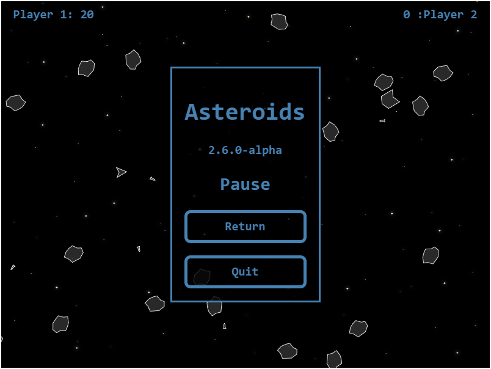

# Asteroids JS (alpha)

**Play now:** [Live demo on GitHub Pages](https://nanodoman.github.io/Asteroids/)

Simple game in style of classic asteroids, made with pure HTML, CSS and JavaScript.\
Objective is to avoid colliding with random asteroids and shoot them for points.

This projects was created as personal self-growth journey and experiment with semVer.

## Screenshots

Click to view full size:

## Controls

### Global

`P` – Pause overlay

### Ship controls

|              | Player 1 | Player 2 |
| -----------: | :------: | :------: |
| **Throttle** |   `W`    |   `↑`    |
|     **Turn** | `A` `D`  | `←` `→`  |
|    **Shoot** |   `F`    |   `/`    |
|  **Respawn** | `Space`  | `Enter`  |

## Versioning

This project tries to apply [Semantic Versioning](https://semver.org/).\
Current version: `2.1.0-alpha`\
See [Changelog.md](docs/changelog.md) for project history

# Roadmap

See [Roadmap.md](docs/roadmap.md) for detailed list

- [x] Basic mechanics and
- [x] Menu
- [ ] Game modes
- [ ] Ship upgrades
- [ ] Pickups
- [ ] Effects
- [ ] Score screen
- [ ] Debug Overlay
